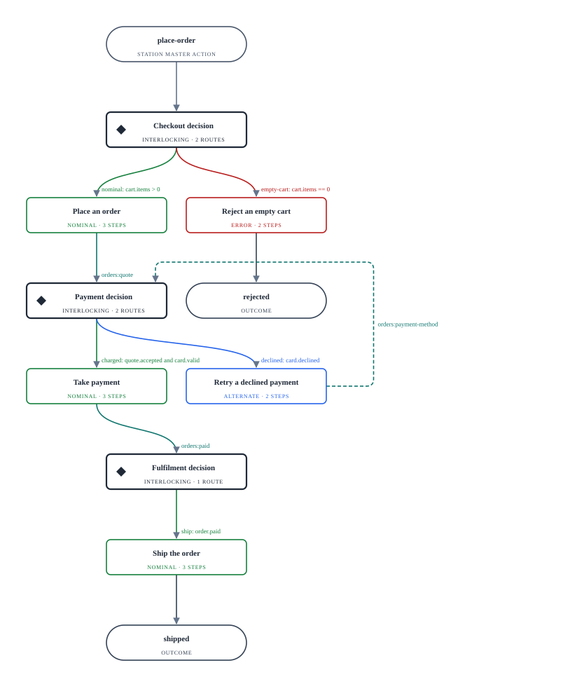
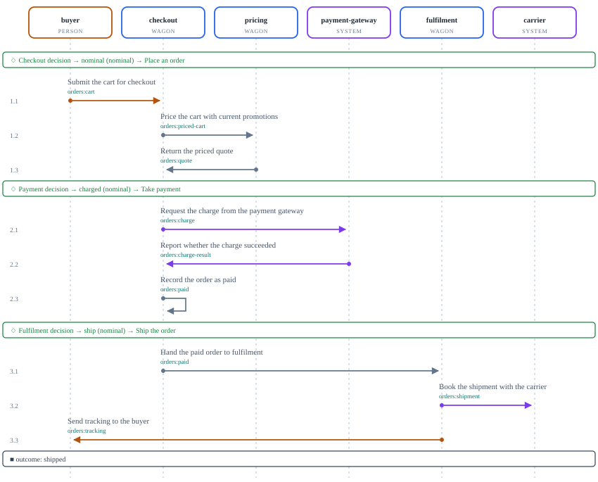
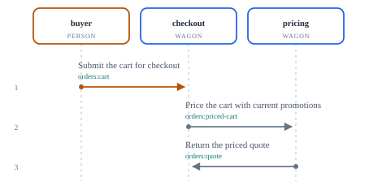
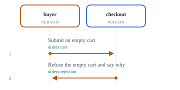
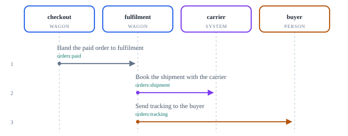
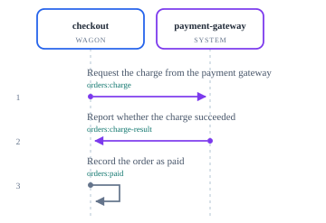
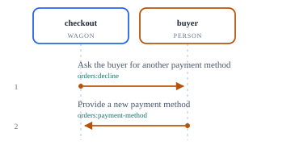
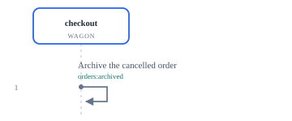

= Journeys
:doc-id: purpose.journeys
:status: generated
:toc: left
:toclevels: 2
:sectanchors:

// Generated by @afokapu/atdd-bun from plan/. Do not edit; run `atdd-bun docs journeys`.

[.headline]
The journeys this plan declares, the interlockings they pass through, and the trains those run, drawn from `plan/`. These are planned behaviour, not acceptance evidence.

== Coverage

[cols="1,1,1,1,1",options="header"]
|===
| Journeys | Interlockings reached | Routes | Trains | Gaps

| 1
| 3 of 4
| 6
| 7
| 2
|===

== Gaps

What the plan leaves unconnected. Each row is a decision still to be made in `plan/`.

[cols="1,2,3",options="header"]
|===
| Gap | Subject | Detail

| unreached interlocking
| `+interlocking:returns+`
| no journey enters or continues into it

| unrouted train
| `+train:orders:unrouted-refund+`
| no interlocking route selects it

|===

== Buy a product

`+journey:buy+` · checked · enters at `+interlocking:checkout+` · exposed through `+place-order+` · source `+plan/_journeys/buy.yaml+`

=== Nominal path, end to end

Checkout decision → nominal ⇒ Payment decision → charged ⇒ Fulfilment decision → ship ⇒ *shipped*

=== Every path

[cols="1,6,2",options="header"]
|===
| # | Interlocking → route, in order | Ends

| 1
| Checkout decision → nominal ⇒ Payment decision → charged ⇒ Fulfilment decision → ship
| shipped

| 2
| Checkout decision → nominal ⇒ Payment decision → declined
| declined

| 3
| Checkout decision → empty-cart
| rejected

|===

== Interlockings and their trains

=== Checkout decision

`+interlocking:checkout+` · exposed through `+place-order+` · source `+plan/_trains/_interlockings/checkout.yaml+`

[cols="1,1,3,3",options="header"]
|===
| Priority | Category | Taken when | Runs

| 1
| nominal
| `+cart.items > 0+`
| `+train:orders:place-order+`

| 2
| error
| `+cart.items == 0+`
| `+train:orders:reject-empty-cart+`

|===

==== nominal (nominal): Place an order

==== empty-cart (error): Reject an empty cart

=== Fulfilment decision

`+interlocking:fulfilment+` · internal · source `+plan/_trains/_interlockings/fulfilment.yaml+`

[cols="1,1,3,3",options="header"]
|===
| Priority | Category | Taken when | Runs

| 1
| nominal
| `+order.paid+`
| `+train:orders:ship-order+`

|===

==== ship (nominal): Ship the order

=== Payment decision

`+interlocking:payment+` · internal · source `+plan/_trains/_interlockings/payment.yaml+`

[cols="1,1,3,3",options="header"]
|===
| Priority | Category | Taken when | Runs

| 1
| nominal
| `+quote.accepted and card.valid+`
| `+train:orders:take-payment+`

| 2
| alternate
| `+card.declined+`
| `+train:orders:retry-payment+`

|===

==== charged (nominal): Take payment

==== declined (alternate): Retry a declined payment

=== Returns decision

`+interlocking:returns+` · internal · source `+plan/_trains/_interlockings/returns.yaml+`

[cols="1,1,3,3",options="header"]
|===
| Priority | Category | Taken when | Runs

| 1
| nominal
| `+order.cancelled+`
| `+train:orders:archive-order+`

|===

==== archive (nominal): Archive a cancelled order

